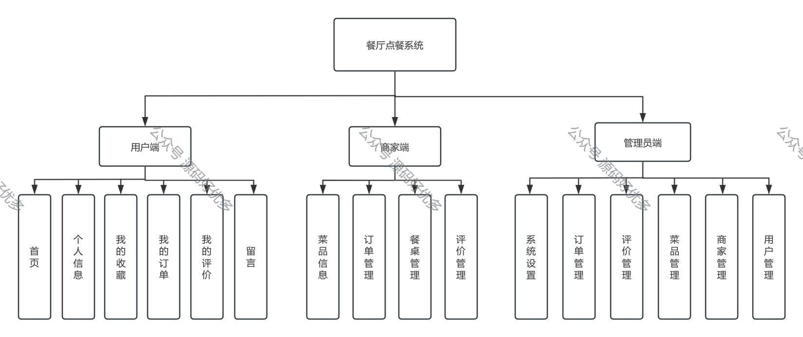
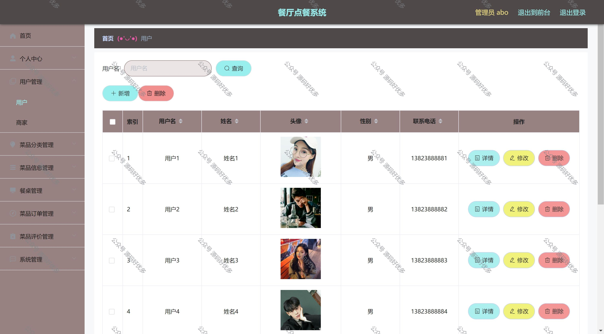
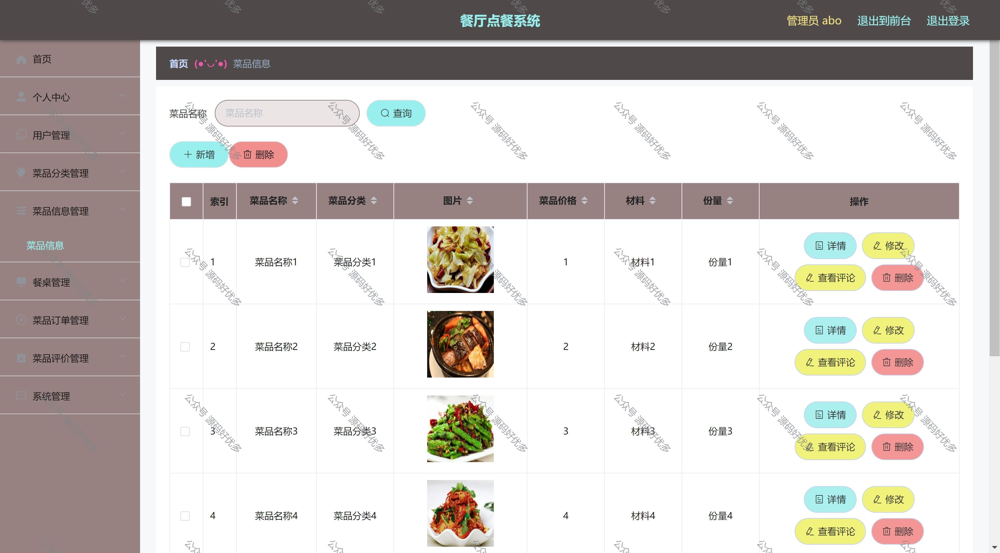
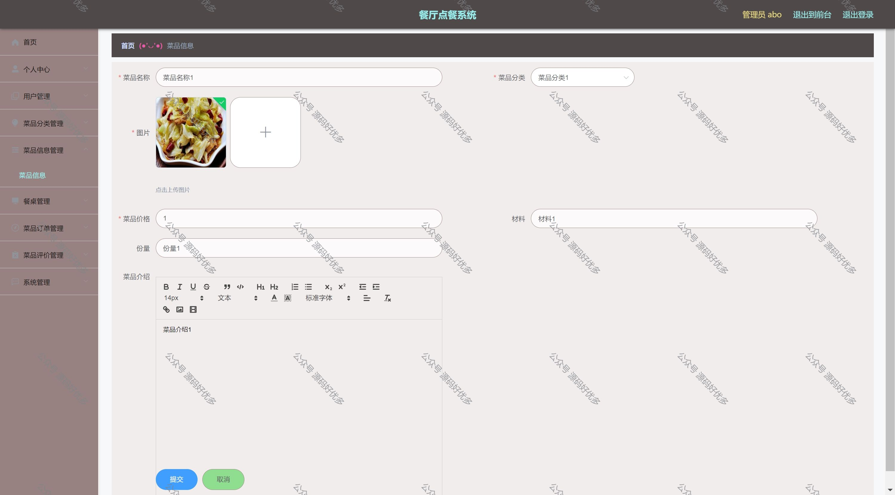
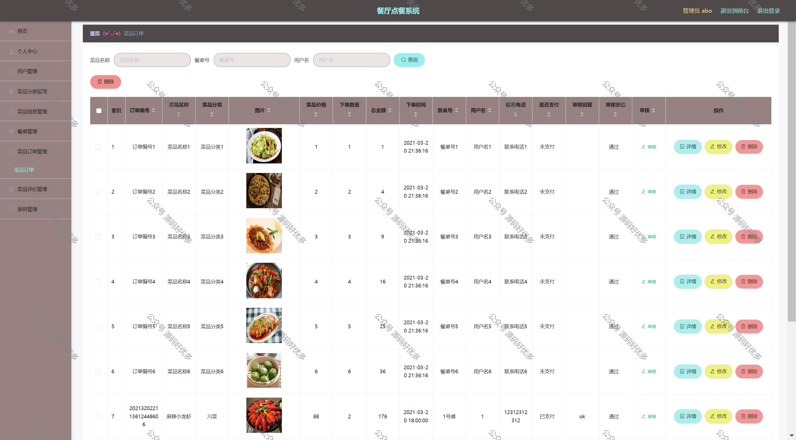
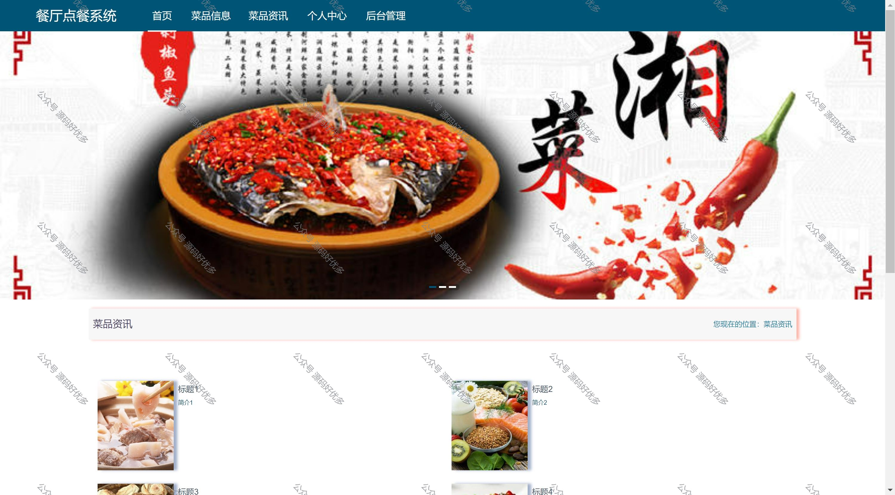
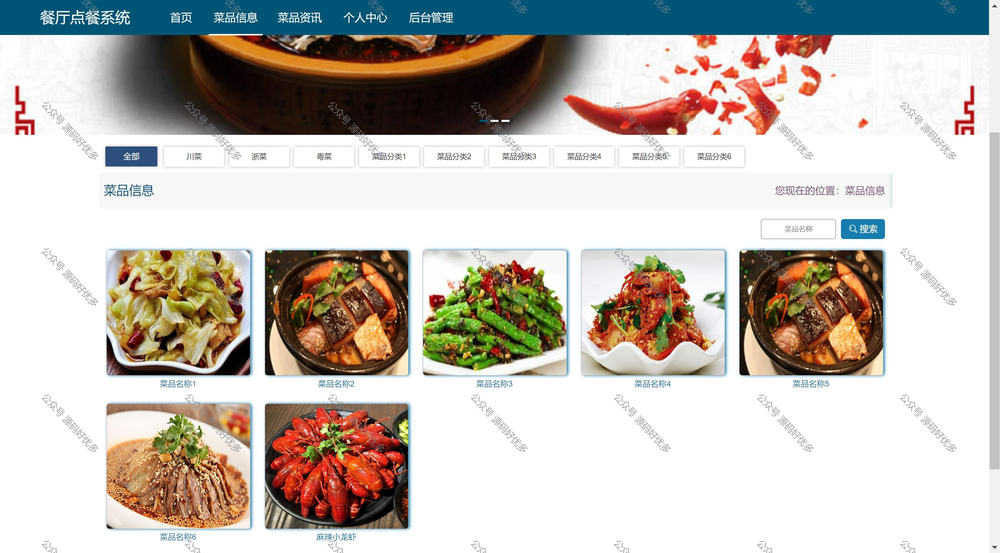
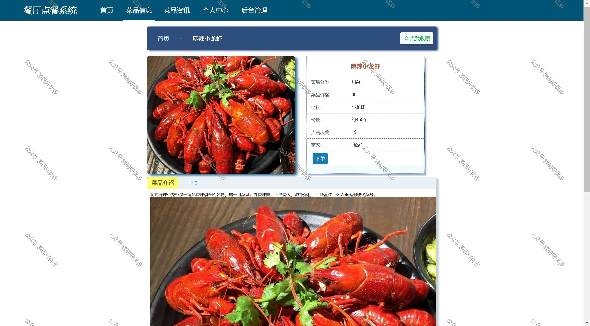
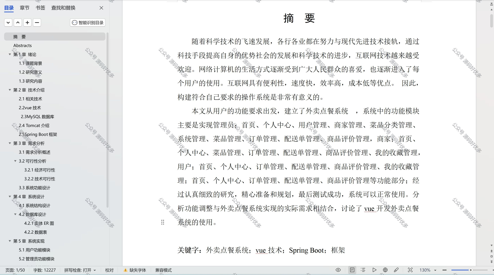

 
## 查看主页获取源码

> **作者介绍**： **✌**全网粉丝10W+本平台特邀作者、博客专家、CSDN新星计划导师、java领域优质创作者,博客之星、掘金/华为云/阿里云/InfoQ等平台优质作者、专注于项目实战 **✌**

  

### 一、作品包含

源码+数据库+设计文档万字+全套环境和工具资源+部署教程

### 二、项目技术

前端技术：Html、Css、Js、Vue

数据库：MySQL

后端技术：Java、Spring Boot、MyBatis

### 三、运行环境

开发工具：IDEA

数据库：MySQL5.7

数据库管理工具：Navicat10以上版本

环境配置软件： JDK1.8+Maven3.6.3

前端Nodejs：14

### 四、项目介绍
项目编号：springbootA048

管理员：
首页、个人中心、用户管理、商家管理、菜品分类管理、系统管理、菜品管理、订单管理、配送单管理、商品评价管理
商家：
首页、个人中心、菜品管理、订单管理、配送单管理、商品评价管理、我的收藏管理
用户：
首页、个人中心、订单管理、配送单管理、商品评价管理、我的收藏管理

### 五、运行截图

